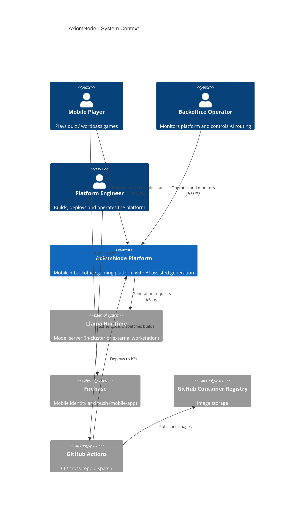
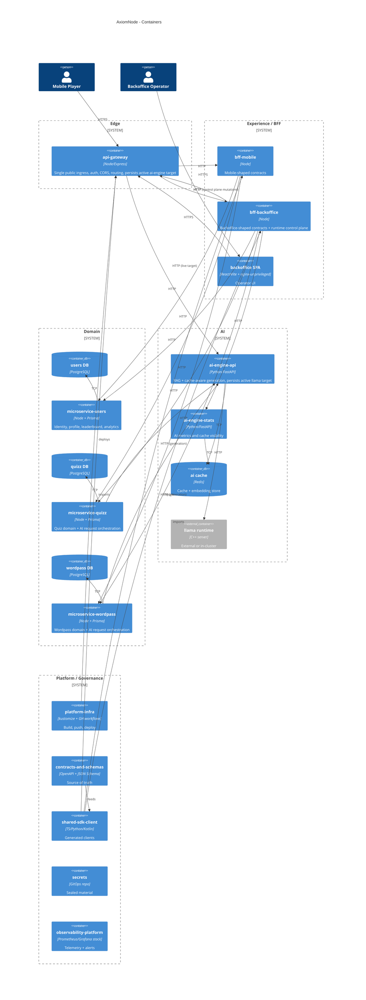

# C4 Views

Last updated: 2026-04-22.

This document captures the AxiomNode platform using the C4 model: System Context (Level 1), Containers (Level 2), and Components (Level 3) for the most relevant containers. Level 4 (code) is intentionally omitted; it lives in each repository.

## Level 1 - System Context

## Level 2 - Container View

## Level 3 - Components

### api-gateway

- `RouteRegistry` — declarative route map, version-aware.
- `Forwarder` (`proxy` SDK module) — `forwardHttp` with structured upstream errors.
- `ContractGuards` — Zod-based validation for shared public query contracts.
- `RuntimeTargetStore` — persists active ai-engine API/stats target on mounted PV.
- `EdgePolicy` — auth, CORS, rate-limit hooks.

### bff-backoffice

- `OperatorAuth` — session and role resolution against `microservice-users`.
- `ServiceTargetOverrideStore` — persists per-route upstream overrides.
- `AIPresetStore` — reusable ai-engine destination presets.
- `MetricsAggregator` — adapts upstream metrics caches with normalized TTL keys.
- `RowsQueryEngine` — UI-side filter with precomputed lowercase row strings.

### ai-engine-api

- `RAGRetriever` — multilingual MiniLM embeddings + metadata-aware oversample/rerank.
- `Optimizer` — query enrichment with category name, model, corpus signature.
- `CacheManager` — keyed by category, embedding model, corpus signature.
- `LlamaClient` — points to active llama target (persisted).
- `Diagnostics` — structured counters surfaced via FastAPI hooks.

### microservice-quizz / wordpass

- `Domain` — Prisma models incl. `GameGeneration` with `difficultyPercentage`.
- `AIClient` — calls `ai-engine-api` with category-aware payload.
- `HistoryQuery` — DB-level difficulty filter (no over-fetch).
- `RandomModelSelector` — same DB-level filter pattern.

### platform-infra

- `BuildPushWorkflow` — receives dispatch, builds, publishes `:sha`/`:stg`/`:prod`.
- `DeployWorkflow` — `kubectl apply -k overlays/{env}` with smoke checks.
- `Overlays` — `dev`, `stg`, `prod` (+ optional full-AI overlay).
- `SealedSecrets` — per-overlay sealed material.

## Notes on diagram authority

- These views describe the current platform state; aspirational changes go to ADRs first.
- Effective runtime topology can deviate from this diagram for the AI subsystem; see [target architecture](./target-architecture.md) and [runtime routing](../operations/runtime-routing-and-service-targeting.md).
