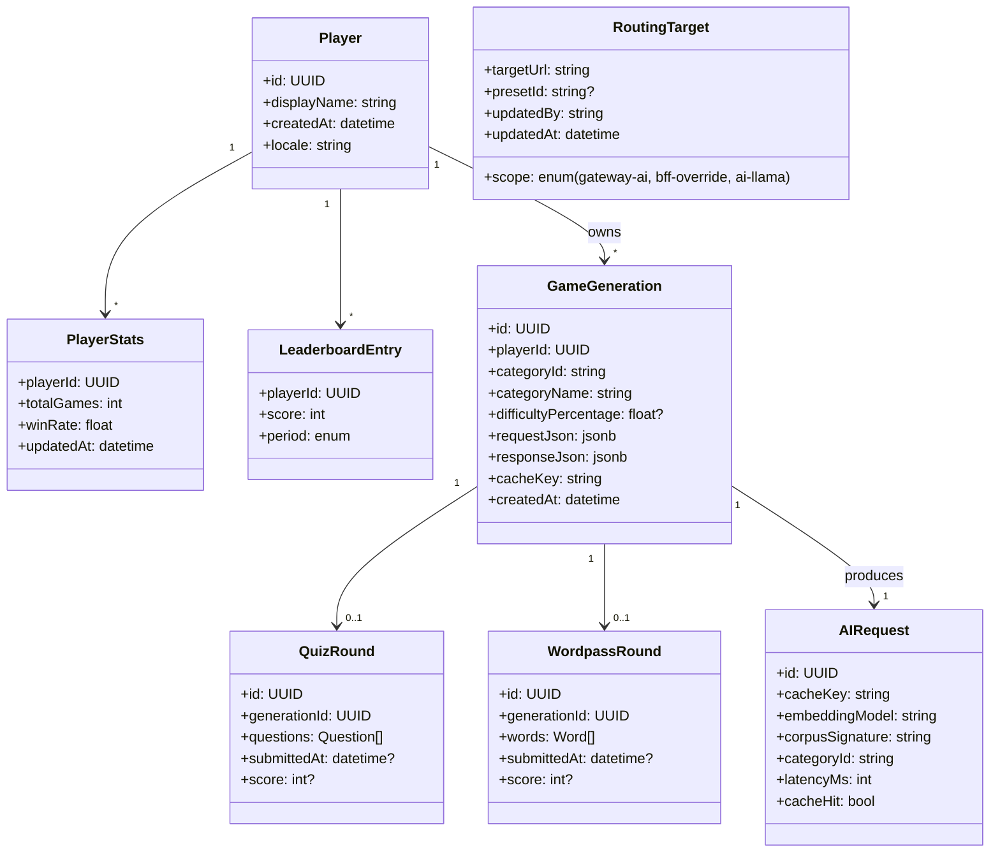

# Domain Model

Last updated: 2026-04-22.

High-level domain model of the AxiomNode platform. Each bounded context is owned by exactly one microservice; cross-context references travel by ID and never by foreign-key joins across databases.

## Bounded contexts

| Context | Owner | Persistence | Public-facing? |
|---|---|---|---|
| Identity & Player Profile | `microservice-users` | PostgreSQL (users DB) | Indirect (via BFFs) |
| Quiz Gameplay | `microservice-quizz` | PostgreSQL (quizz DB) | Indirect |
| Wordpass Gameplay | `microservice-wordpass` | PostgreSQL (wordpass DB) | Indirect |
| AI Generation | `ai-engine` | Redis cache + vector store + on-disk corpus | Internal only |
| Runtime Routing State | `api-gateway`, `bff-backoffice`, `ai-engine-api` | Mounted PV (per service) | Operator only |
| Contracts | `contracts-and-schemas` | Git | n/a |

## Entities (logical view)

## Aggregates and invariants

### Player aggregate (`microservice-users`)

- Root: `Player`.
- Children: `PlayerStats`, `LeaderboardEntry`.
- Invariants:
  - `displayName` unique per realm.
  - `PlayerStats.updatedAt` monotonic.
  - Leaderboard projections eventually consistent; never primary source.

### GameGeneration aggregate (`microservice-quizz` / `microservice-wordpass`)

- Root: `GameGeneration`.
- Children: `QuizRound` or `WordpassRound`.
- Invariants:
  - `difficultyPercentage` materialized from `requestJson` at write time (Prisma migration backfill, see audit 2026-04-19).
  - `cacheKey` includes `categoryId`, embedding model, corpus signature.
  - Cross-context references to `playerId` are by ID only.

### AIRequest aggregate (`ai-engine`)

- Root: `AIRequest`.
- Invariants:
  - `cacheKey` uniquely identifies a generation request shape.
  - `corpusSignature` change invalidates dependent cached entries logically.

### RoutingTarget (control-plane state, distributed)

- Root: `RoutingTarget` keyed by `scope`.
- Invariants:
  - At most one active target per scope per service instance share the mounted PV.
  - Drift between scopes is allowed but observable (operators can see effective vs declared).

## Cross-context contracts

| Contract | Producer | Consumer | Source |
|---|---|---|---|
| `RandomGameQuerySchema` | `contracts-and-schemas` | `api-gateway`, `bff-mobile`, `microservice-{quizz,wordpass}` | shared SDK |
| `LeaderboardQuerySchema` | `contracts-and-schemas` | `api-gateway`, `bff-mobile`, `microservice-users` | shared SDK |
| `GameCategoriesSchema` | `contracts-and-schemas` (json) | `shared-sdk-client/typescript`, gameplay services | generated at SDK build |
| AI generation request | `contracts-and-schemas/openapi/ai-engine` | quiz/wordpass, bff-backoffice | generated client |

## Anti-patterns explicitly rejected

- Cross-database joins between bounded contexts.
- Sharing Prisma schemas across services.
- Storing routing state in environment variables when it must survive pod restarts (use mounted PV instead).
- Embedding generated AI content as part of player identity records.

## Related documents

- [Repository map](./repository-map.md)
- [Use cases](./use-cases.md)
- [Key sequence flows](./key-sequence-flows.md)
