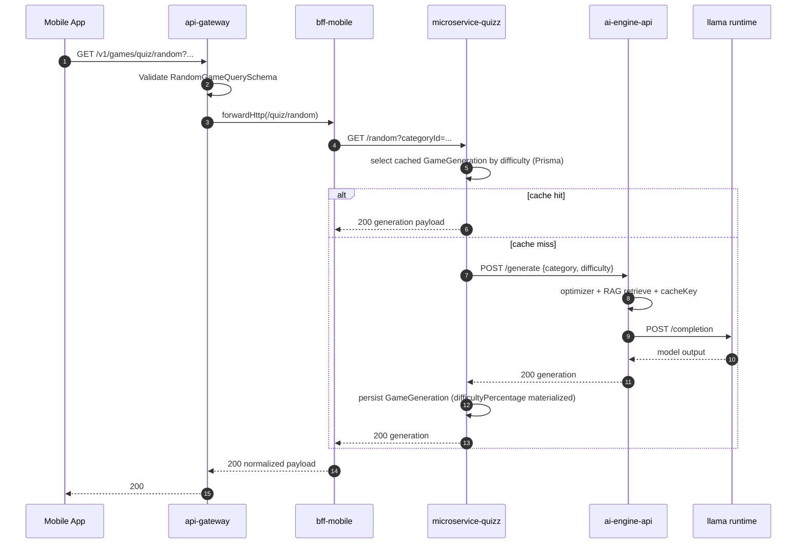
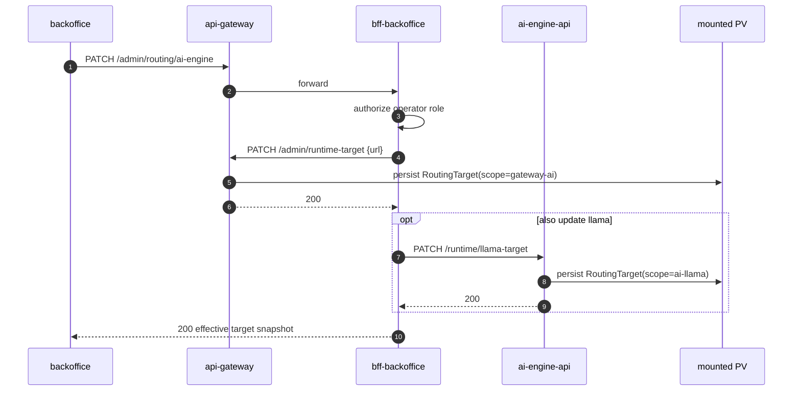
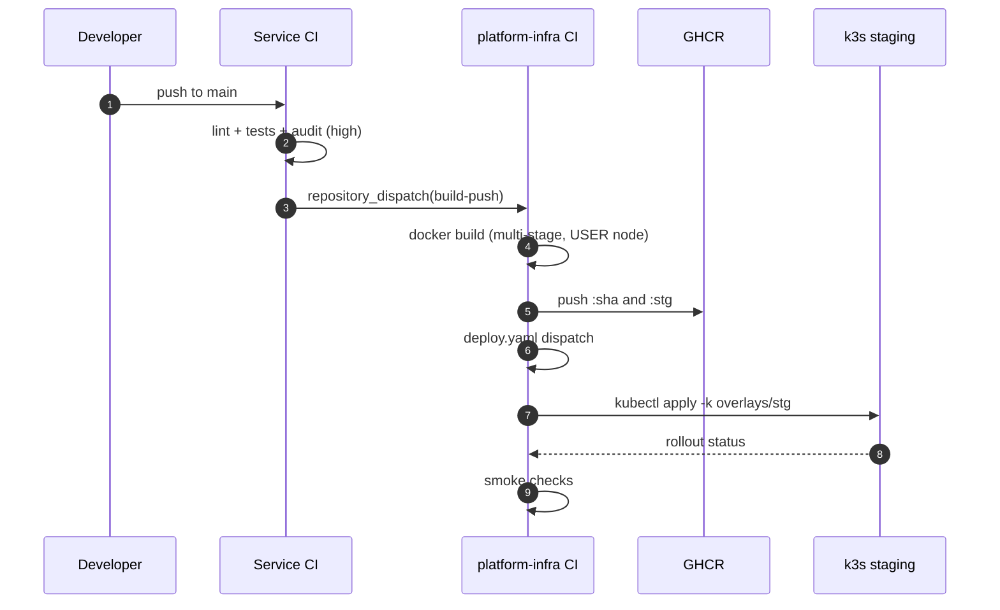
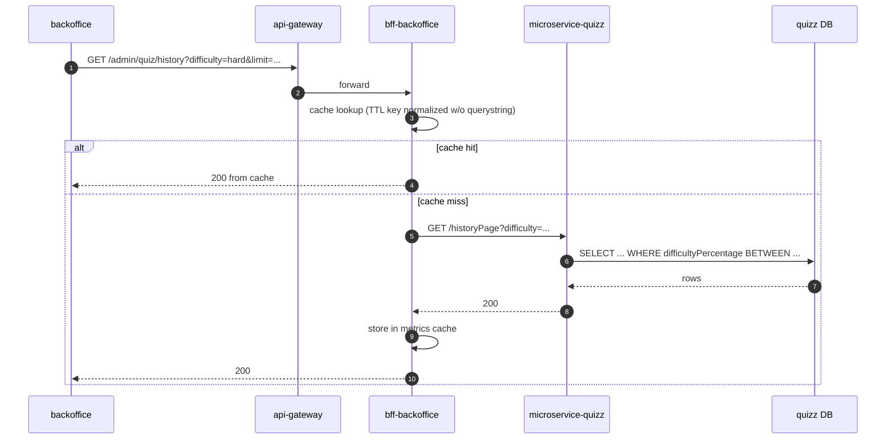
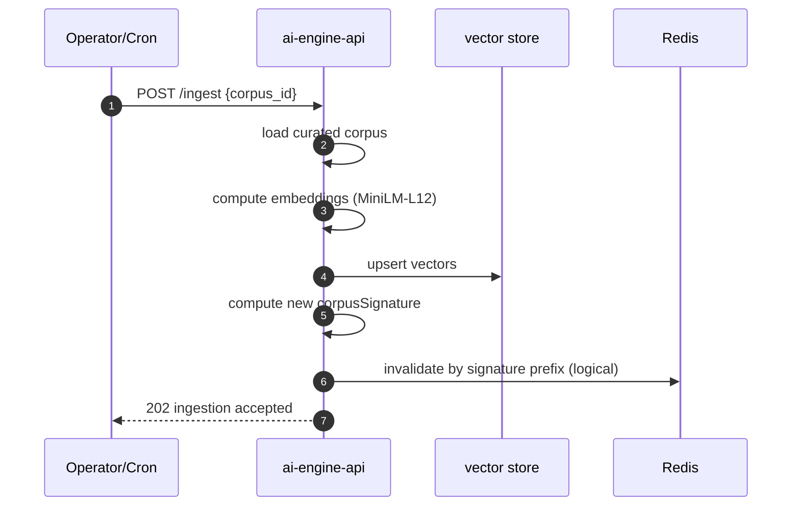
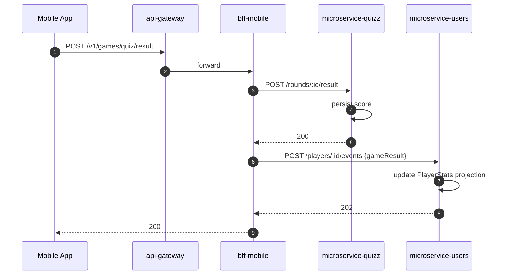

# Key Sequence Flows

Last updated: 2026-04-22.

Sequence diagrams of the most important runtime flows. Each flow lists the use case it satisfies and the failure points to consider.

## SF-01 Mobile player starts a quiz round (UC-01)

Failure points:
- Invalid query → 400 from gateway, never reaches BFF.
- AI cache miss + llama unreachable → 503 surfaced with correlation id.
- DB unreachable → 5xx, no partial writes.

## SF-02 Backoffice operator changes runtime AI target (UC-09)

Failure points:
- PV write failure → revert in-memory state, return 5xx.
- Drift vs manifests is expected; runbook documents reconciliation.

## SF-03 CI/CD build and staging deploy (UC-12, UC-13)

Failure points:
- Service CI failure → no dispatch.
- Image digest mismatch → deploy aborts.
- Smoke check fail → rollout marked unhealthy; manual intervention.

## SF-04 Operator inspects AI history with difficulty filter (UC-06)

Failure points:
- DB slow query → BFF returns 504 after upstream timeout.
- Cache stampede → mitigated by short TTL + per-path key normalization.

## SF-05 AI ingest / corpus refresh (UC-11)

Failure points:
- Embedding model load failure → ingestion aborts, previous signature retained.
- Vector store partial write → ingestion marked failed; retry idempotent.

## SF-06 Player submits gameplay result (UC-03)

Failure points:
- Q write fails → no analytics call; gateway returns 5xx.
- U analytics call fails → considered eventually consistent; logged for replay.

## Related documents

- [Use cases](./use-cases.md)
- [Domain model](./domain-model.md)
- [Target architecture](./target-architecture.md)
- [Runtime routing](../operations/runtime-routing-and-service-targeting.md)
