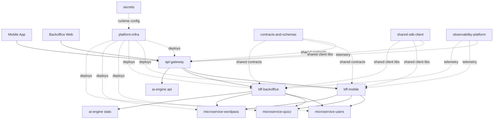

# Target Architecture

## Goal

Define the target runtime and delivery architecture for mobile and backoffice channels on top of a microservice platform with AI-assisted generation capabilities and centralized deployment governance.

## Architectural overview

## Main layers

1. Edge layer: `api-gateway` is the single public ingress and policy boundary.
2. Experience layer: `bff-mobile` and `bff-backoffice` expose channel-shaped contracts.
3. Domain services: `microservice-users`, `microservice-quizz`, `microservice-wordpass`, and optional `ai-engine` endpoints.
4. Data and async layer: service-owned data stores and deferred generation flows.
5. Platform layer: `platform-infra`, `observability-platform`, `contracts-and-schemas`, `shared-sdk-client`, and `secrets`.

## Runtime topology

### Default deployable core

The deployable core for staging and production-oriented flows is:

- `api-gateway`
- `bff-mobile`
- `bff-backoffice`
- `backoffice`
- `microservice-users`
- `microservice-quizz`
- `microservice-wordpass`

### Optional AI topology

`ai-engine` is architecturally part of the platform, but it is no longer assumed to be always in-cluster for staging.

The current architecture supports two valid runtime modes:

1. in-cluster AI runtime
2. external workstation-hosted AI runtime reachable through controlled routing

That distinction is important: deployment topology and effective runtime topology are no longer always the same thing.

## Runtime routing control plane

Backoffice operational tooling now acts as a lightweight runtime control plane for non-static upstream selection.

Current capabilities:

- `bff-backoffice` can persist shared upstream routing overrides
- `api-gateway` can persist the live `ai-engine` target used by the platform
- backoffice operators can select and manage reusable ai-engine destination presets
- routing state survives pod recreation because it is stored on mounted persistent volumes

This control-plane behavior is intentionally narrow in scope: it does not replace GitOps or declarative infrastructure, but it provides pragmatic runtime flexibility for operational AI connectivity.

## Delivery architecture

The delivery architecture is intentionally split:

- service repositories own correctness checks
- `platform-infra` owns container build and deployment policy

This preserves local service autonomy without fragmenting the deployment contract.

## Architecture principles

- single public ingress
- private internal APIs by default
- versioned and traceable contracts
- observability-first runtime model
- secure-by-default posture
- immutable artifacts for automated deployment
- operational flexibility only where topology genuinely requires it

## Quality attributes

### Maintainability

- deployment policy is centralized in one repository
- service CI remains close to service code
- shared contracts and SDKs reduce edge/BFF drift
- runtime routing exceptions are documented and persisted, not hidden in ad hoc pod edits

### Traceability

- automatic staging deploys are tied to immutable image SHAs
- service CI, central packaging, and deployment workflows form a clear audit chain

### Operability

- smoke tests and rollout checks are embedded in deployment workflows
- runtime overrides for AI connectivity can be changed without rebuilding or redeploying the entire stack

### Evolvability

- the architecture can support in-cluster or external AI execution
- production can remain stricter than staging without changing the service contract model

## Current architectural constraints

- staging still depends on certain mutable environment tags for manual operations
- runtime overrides introduce a second operational state plane that must be documented and observed
- not every repository in the workspace is part of the GHCR-to-k3s delivery chain

## Related documents

- `docs/operations/cicd-workflow-map.md`
- `docs/operations/deployment-strategy.md`
- `docs/operations/runtime-routing-and-service-targeting.md`
