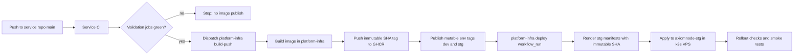

# CI/CD Workflow Map

Last updated: 2026-04-19.

This document describes the current production-grade CI/CD chain across the AxiomNode workspace. It focuses on the services that publish container images and can trigger automatic rollout to the staging VPS.

## Scope

Runtime services currently covered by the automated image build and staging deployment chain:

- `api-gateway`
- `bff-mobile`
- `bff-backoffice`
- `backoffice`
- `microservice-quizz`
- `microservice-wordpass`
- `microservice-users`

Excluded from this specific chain:

- `mobile-app`: validated in its own repository, but it does not publish a GHCR runtime image or deploy to k3s through `platform-infra`
- `ai-engine`: publishes separately and is currently optional for staging because the active staging topology allows the engine to run outside the cluster

## Delivery model

The platform uses a two-step model:

1. Each service repository owns service-level quality gates.
2. `platform-infra` owns image packaging, GHCR publication, and Kubernetes rollout.

This split keeps service validation close to service code while centralizing deployment policy, credentials, and cluster orchestration.

## End-to-end flow

## Service repository responsibilities

Every covered service repository has its own `.github/workflows/ci.yml`.

Typical responsibilities:

- install dependencies
- build or compile
- execute unit and integration tests
- lint and static checks
- run repository-specific smoke tests when needed
- dispatch the central packaging workflow only after the repository validation stage succeeds on `main`

As of 2026-04-19, the dispatch-to-infra step is explicitly gated by the service validation jobs. This is an important safety guarantee: a push to `main` no longer publishes an image if the service CI itself is red.

## Central packaging in platform-infra

`platform-infra/.github/workflows/build-push.yaml` is the single source of truth for image publication.

Responsibilities:

- detect changed services for local `platform-infra` pushes
- support manual dispatch for one service or all services
- checkout the correct source repository for the target service
- checkout cross-repo dependencies when required
- build the correct Docker context and Dockerfile per service
- publish images to GHCR

### Tag policy

For `main` builds:

- immutable short-SHA tag is always published
- mutable `dev` tag is published
- mutable `stg` tag is published
- mutable `prod` tag is published only by manual promotion with `publish_prod_tag=true`

For non-`main` builds:

- immutable short-SHA tag is published
- mutable `dev` tag is published

The deployment workflow prefers immutable short-SHA references for automatic staging rollout. Mutable tags remain useful for manual promotion flows and controlled refreshes.

## Automatic deployment policy

`platform-infra/.github/workflows/deploy.yaml` is triggered in two modes:

1. `workflow_run` after successful completion of `Build & Push Docker Images` on `main`
2. manual dispatch for targeted environment deployment

Current policy:

- automatic target environment is `stg`
- automatic deploys render the staging overlay with immutable image overrides derived from the triggering build run
- manual deploys may target `stg` or `prod`
- manual deploys keep environment tags and force restart when mutable tags must be refreshed

This means staging behaves as the continuous integration environment for deployable runtime services, while production remains a controlled promotion target.

## Runtime guarantees

The current chain guarantees the following for covered services:

- no automatic image publish unless the service repository quality gate passes
- no automatic staging deploy unless the central image build succeeds
- staging deployment consumes the exact image built by the triggering run, not a later mutable tag
- rollout waits for Kubernetes deployment progress and available replica checks
- staging deploy concludes with smoke verification against the public gateway path when applicable

## Use cases

### Use case 1: regular service change on `main`

Example: a change lands in `api-gateway` main.

Expected behavior:

1. service CI runs
2. validation job succeeds
3. dispatch to `platform-infra` occurs
4. image is published to GHCR
5. `platform-infra` deploy updates staging automatically

### Use case 2: service CI fails

Example: lint or tests fail in `microservice-users`.

Expected behavior:

1. service CI fails
2. dispatch job is blocked by `needs`
3. no image is published from that service change
4. no staging rollout is triggered from that change

### Use case 3: manual environment refresh

Example: an operator wants to redeploy `backoffice` to `prod`.

Expected behavior:

1. manual dispatch of `platform-infra` deploy workflow
2. selected environment and service are rendered
3. mutable environment tags can be reused
4. explicit rollout restart is performed when needed

### Use case 4: staging with externalized ai-engine

The service deployment chain continues to auto-update the cluster services even when `ai-engine` is external to the cluster. Runtime wiring for the engine is then controlled from the backoffice routing layer, not by auto-deploying the engine itself.

## Failure domains

The chain can fail in the following distinct places:

- service repository CI failure
- missing `PLATFORM_INFRA_DISPATCH_TOKEN` in the service repo
- missing `CROSS_REPO_READ_TOKEN` in `platform-infra`
- GHCR authentication or package publication failure
- k3s SSH connectivity failure
- Kubernetes rollout failure
- smoke-test failure after rollout

Each failure domain stops promotion at its own level and should be diagnosed in the repository that owns that stage.

## Required secrets

### In service repositories

- `PLATFORM_INFRA_DISPATCH_TOKEN`

### In `platform-infra`

- `CROSS_REPO_READ_TOKEN`
- `GHCR_PULL_USERNAME`
- `GHCR_PULL_TOKEN`
- `K3S_HOST`
- `K3S_USER`
- `K3S_SSH_KEY`

### In `secrets`

- `SECRETS_CROSS_REPO_READ_TOKEN`

## Governance notes

- Deployment policy is centralized in `platform-infra`, not duplicated across service repositories.
- Mutable environment tags exist for operations convenience, but automatic staging deploys use immutable short-SHA image references.
- Documentation that still mentions automatic `dev` deployment is obsolete and should be considered superseded by this document.

## Related documents

- `docs/operations/deployment-strategy.md`
- `docs/operations/runtime-routing-and-service-targeting.md`
- `platform-infra/README.md`
- `platform-infra/kubernetes/README.md`
