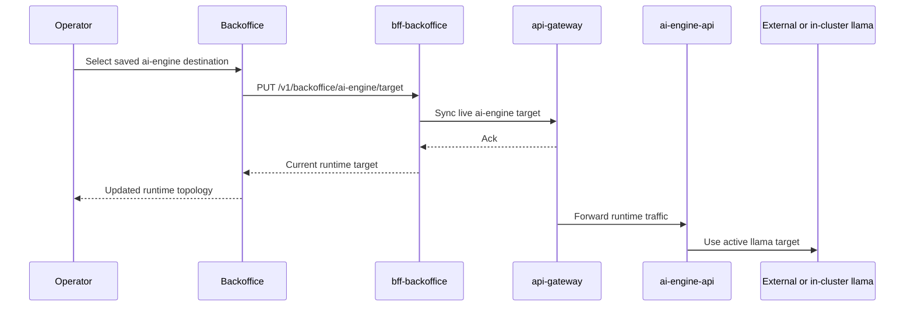

# Runtime Routing And Service Targeting

Last updated: 2026-04-19.

## Purpose

This document explains the runtime routing controls that exist outside the static Kubernetes manifests. It is intentionally separate from deployment documentation because the effective topology can differ from the deployed topology, especially for `ai-engine`.

## Why this exists

Most services are deployed declaratively through `platform-infra`. However, the platform also supports operational retargeting for selected upstreams when a service must temporarily point to:

- a workstation-hosted dependency
- an alternate node
- a relay endpoint
- a controlled fallback instance

The current primary use case is `ai-engine` externalization in staging.

## Components involved

### `bff-backoffice`

Responsibilities:

- expose operational APIs for service target inspection and override
- persist shared routing state for backoffice-driven upstream changes
- persist reusable ai-engine destination presets shared across browsers and operators

### `api-gateway`

Responsibilities:

- hold the active live ai-engine target used by the runtime request path
- enforce approved-host rules through environment-level allowlists

### `ai-engine-api`

Responsibilities:

- hold the active llama target used by generation requests
- preserve effective model-runtime selection across restart or pod recreation
- allow split-AI staging to keep API/stats in-cluster while the model runtime remains elsewhere

### `backoffice`

Responsibilities:

- expose operator-facing controls in diagnostics and service overview panels
- allow shared preset management for ai-engine destinations
- allow live runtime target application without a full redeploy

## Current runtime routing use cases

### Use case 1: staging ai-engine runs on an external workstation

Effective path:

1. backoffice operator selects a shared ai-engine preset
2. `bff-backoffice` calls the compatibility route to apply the target
3. `api-gateway` stores the live target
4. requests to ai-engine are forwarded to the configured host and ports

### Use case 2: backoffice needs a shared list of candidate ai-engine destinations

The preset list is stored in `bff-backoffice` persisted runtime state so all browsers see the same options.

### Use case 3: operator wants to revert to environment defaults

The routing layer supports returning from override state back to environment-derived endpoints.

### Use case 4: split-AI staging keeps API in-cluster but llama external

Effective path:

1. cluster services call `ai-engine-api`
2. `ai-engine-api` resolves its active llama target
3. model traffic reaches the selected external or alternate llama runtime
4. API/stats remain observable through the cluster even if model execution lives elsewhere

## Persistence model

### `bff-backoffice`

Stores routing state in a small persistent JSON file on mounted storage.

Persists:

- configurable service target overrides
- shared ai-engine destination presets

### `api-gateway`

Stores the active ai-engine target in its own persistent JSON file on mounted storage.

Persists:

- active ai-engine API and stats host/port target

This design survives pod recreation. It is not limited to in-memory process state.

### `ai-engine-api`

Stores the active llama target in its own persistent runtime state file on mounted storage.

Persists:

- active llama host/port target used by generation traffic

This means the AI execution path can diverge from environment defaults even when the API deployment itself is healthy.

## Security boundaries

Runtime retargeting is constrained by allowlists.

Key rule:

- operators may change where traffic points only within the bounds allowed by `ALLOWED_ROUTING_TARGET_HOSTS`

This prevents unrestricted arbitrary SSRF-style retargeting.

## Operational model

## Design trade-offs

Benefits:

- fast operational recovery without full cluster redeploy
- shared operator-visible presets instead of private browser-only state
- preserved staging productivity when AI infrastructure is temporarily external

Costs:

- runtime state is no longer fully described by Kubernetes manifests alone
- operators must understand both declarative deploy state and runtime override state
- documentation and observability must explicitly surface the active target source

## Rules for maintainability

- keep runtime targeting limited to clearly justified services
- persist overrides and presets; do not rely on ad hoc manual pod edits
- expose current source state as `env` or `override`
- document all operator-facing control paths
- prefer shared backend persistence over browser-local state for team-operated controls

## Recommended documentation practice

When a new runtime routing capability is introduced, update at least:

- architecture overview
- deployment and CI/CD documentation
- operator runbook or diagnostics documentation
- persisted state or secret ownership notes

## Related documents

- `docs/architecture/target-architecture.md`
- `docs/operations/cicd-workflow-map.md`
- `platform-infra/kubernetes/README.md`